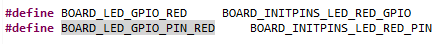
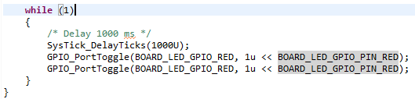
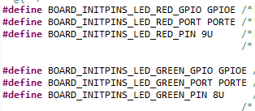
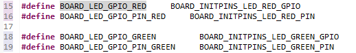
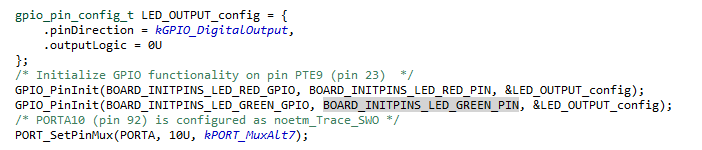
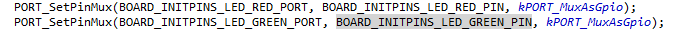
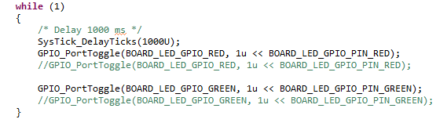

Como experimento, voy hacer que otro LED, como por ejemplo el verde, se prenda y apague a la misma frecuencia de la del LED rojo. 

Primero especifiqué las anteriores definiciones, como unicamente las del LED rojo. Esto tanto en el archivo base de led_blinky, como en el pin_mux.

Luego definí lo necesario para el led verde en pin_mux.h: 

y en el código base: 

y activé el GPIO en pin_mux.c

y el mux del pin verde nuevo: 

y por lo tanto el bucle quedó de la siguiente manera: 

comentando las lineas de código que apagaban nuevamente los leds