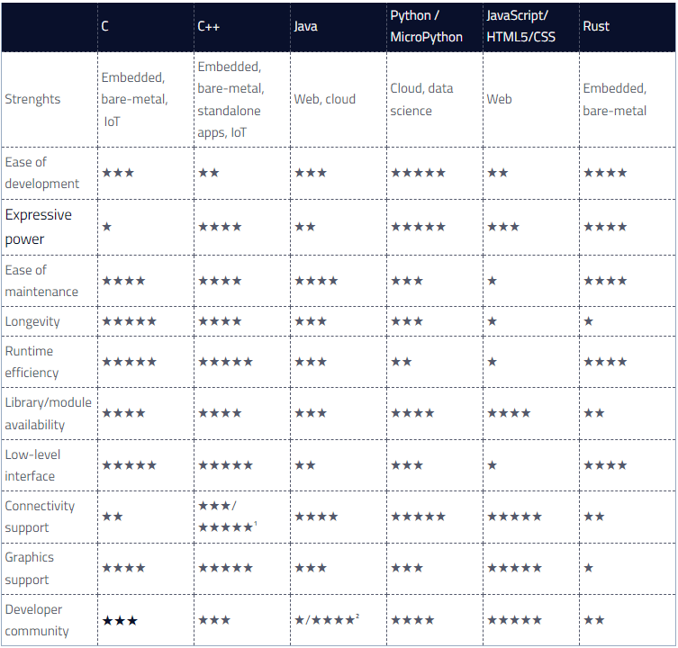

# Ejercicio 1
## 1. Lenguajes en los que se puede programar sistemas embebidos

- Directamente en Assembly 
- C 
- C++ 
- Python
- Rust
- Java
- Ada 

 

## 2. Pros y contras

**Lenguajes**               | **Características**               | **Pros**            | **Contras**              |
|--------------------------------|----------------------------|--------------------------------|------------------------------|
| Assembly     | Garantiza un acceso de "bajo-nivel" a la memoria el cual garantiza una manipulación de hardware de manera eficiente.|
Altamente eficiente en la memoria.  
Estable. 
Rápido. 
No depende del hardware, por lo que se puede migrar a otros sistemas.
 Acceso a "nivel-bajo" de memoria|  Especialmente complicado de desarrollar y leer |
| C     | Lenguaje Compilado, simple y ampliamente usado en muchas aplicaciones. Es el pilar de muchos otros lenguajes de programación.  Amplia gama en tipos de datos. Permite la separación de un programa en módulos que admiten una compilación independiente.|
Altamente eficiente. 
Estable. 
Rápido. 
No depende del hardware, por lo que se puede migrar a otros sistemas.
 Acceso a "nivel-bajo" de memoria|  
Lenguaje de Bajo nivel, por lo que puede ser difícil para los desarrolladores, pudiéndose enfrentar a dificultades técnicas específicas y complejas.
 Técnicas Modernas de programación pueden ser difíciles de implementar dentro del lenguaje. 
 Deficiencias en la gestión de memoria.      |
| C++  | La intención de su creación fue extender al lenguaje de programación C. Es portátil y tiene un gran número de compiladores de diferentes plataformas y sistemas operativos. Es un lenguaje de alto nivel. Lenguaje orientado a objetos | 
 También tiene acceso al "nivel-bajo" de memoria.
 La compilación y ejecución de un programa en C++ es mucho más rápida que en la mayoría de lenguajes de programación. Incluso, puede ser tan eficiente como en C. 
Tiene potentes librerías que ahorran tiempo a la hora de programar código. 
 Es Orientado a objetos. 
 Se considera más seguro que C |  
 Los elementos de gestión de memoria manual incorporados en C++ implican que el riesgo de fallos de segmentación y fugas de memoria aumenta significativamente, lo que puede provocar fallos del sistema.
 A pesar de considerarse más seguro que C, no es tan seguro como otro tipo de lenguajes, pues utiliza un proceso manual de gestión de memoria y permite el acceso directo al hardware, lo que abre un mundo de vulnerabilidades de seguridad, especialmente si el software no ha sido desarrollado de forma que proteja de los ciberataques. 
 Complejo y puede llegar a ser difícil de aprender. 
 Se enfrenta a problemas de modernización y le cuesta integrarse con nuevas tecnologías sin requerir a extensas librerías adicionales.  |
| Python | 
Lenguaje interpretado, cuya popularidad en sistemas embebidos está en aumento. De alto nivel y orientado a objetos | Facilidad en su escritura, consiso y de fácil lectura. 
 Desarrolladores no necesitan de compilacion cruzada para sistemas embebidos. 
 Una amplia comunidad con potentes librerias, debido a que es un lenguaje de código libre. 
Integración en la nube: el sólido respaldo de Python para la conectividad en la nube facilita el aprovisionamiento sencillo y seguro de sistemas integrados en la nube, lo que permite la transmisión fluida de datos ascendentes. Esto resulta especialmente ventajoso para los dispositivos IoT y otros sistemas que buscan una integración fluida con la nube, permitiendo realizar funciones complejas en dispositivos con recursos limitados. | 
 No es determinístico, por lo tanto no es para sistemas operativos de tiempo real. 
 Sufre la falta de un compilador y analizadores estáticos, que puedan encontrar problemas durante la compilación. 
 Debe ser muy bien testeado para evadir errores durante la corrida.
 Python no suele ser la mejor opción cuando se requiere control directo de recursos de bajo nivel y hardware en sistemas integrados, lo que limita significativamente la depuración y la interacción con componentes de hardware específicos. Esto significa que Python es menos adecuado para escribir código crítico para el rendimiento, lo que podría ser mejor cuando se trata de capacidad de respuesta en tiempo real.  |
| Rust   | El lenguaje se centra principalmente en la seguridad y la concurrencia segura. Rust también tiene una sintaxis similar a C++ y, por lo tanto, se puede integrar fácilmente en las bases de código C/C++ existentes.|
 Gestión y seguridad de la memoria: Rust ofrece un sistema de propiedad y préstamo que reduce significativamente el riesgo de problemas de seguridad relacionados con la memoria y mejora la seguridad de la memoria.  
 Análisis estático: Rust ofrece un análisis estático sólido, lo que significa que el código se revisa antes de ejecutarse, lo que garantiza que sea adecuado y cumpla con los requisitos específicos de antemano. 
  Ofrece una potente concurrencia, lo que significa que se pueden ejecutar varias tareas simultáneamente, lo que lo hace valioso para los sistemas integrados a la hora de reducir errores y mejorar la confiabilidad. 
 Gestión de recursos: Rust se puede utilizar en sistemas físicos y sistemas operativos en tiempo real     | 
 Tiene tiempos de compilación mucho más extensos comparados con otros lenguajes como C++ o C. 
 Tiene una interacción muy limitada con componentes de hardware específicos. 
 Aunque Rust ofrece una combinación de C++ y código existente, el lenguaje de programación necesita mayor extensión, lo que significa que el proceso de integración con otros lenguajes no es un proceso simple, lo que plantea desafíos cuando es necesario fusionar código preexistente. |
| Java   |  Un lenguaje eficiente, multipropósito, usado ampliamente en aplicaciones con internet | 
 Confiable. 
 una vez escrito en un sistema embebido, su código es de muy fácil transferencia a otro dispositivo. 
Java ofrece varias características de seguridad, como sandboxing, para promover la seguridad en entornos con recursos limitados. 
 orientado a objetos. 
 Desarrollo multiplataforma: Java ofrece varias capacidades multiplataforma, lo que proporciona varios beneficios para el desarrollo de sistemas integrados, como el uso de código existente que potencialmente puede implementarse en varios sistemas con una arquitectura variada, lo que resulta muy eficiente en términos de tiempo y costos. | 
 al ser comparado con otros lengaujes como C o C++, tiene menores capacidades de rendimiento, por su interpretación y "recolección de basura". 
 Java plantea un riesgo de sobrecarga de recursos, ya que la máquina virtual Java (JVM) necesita memoria y capacidad de procesamiento para su funcionamiento. 
 Tiene muy poca compatibilidad con el hardware de sistemas embebidos|
| Ada    |   Es un lenguaje de programación creado en los 70s por el departamento de defensa de los Estados Unidos, especialmente diseñado para sistemas embebidos de tiempo-real. Ada también tiene muchas características de soporte críticas para la seguridad que lo hacen útil en aplicaciones militares, aviónica, sistemas espaciales, etc. |  
 Extremadamente confiable y eficiente. 
Ada es útil para la programación de sistemas integrados debido a su fuerte tipado, verificación en tiempo de ejecución, procesamiento paralelo, manejo de excepciones, genéricos, etc. 
 Los paquetes Ada se pueden compilar por separado, ya que fueron creados para el desarrollo de grandes sistemas de software. 
 Ada se utiliza en sistemas críticos ya que admite verificaciones en tiempo de ejecución para detectar errores como violaciones de rango de memoria no asignada, errores de uno en uno, errores de acceso a matriz, etc.| 
  Puede ser un desafío aprenderlo. 
 poco usado|

Referencias: 
* https://www.amoriabond.com/en/insights/blog/the-top-4-programming-languages-for-embedded-systems/
* https://www.geeksforgeeks.org/embedded-systems-programming-languages/
* https://www.qt.io/blog/embedded-software-programming-languages-pros-cons-and-comparisons-of-popular-languages

 

## 3. Ranking

tomado de: https://www.qt.io/blog/embedded-software-programming-languages-pros-cons-and-comparisons-of-popular-languages

otros rankings: 
* https://www.amoriabond.com/en/insights/blog/the-top-4-programming-languages-for-embedded-systems/

* https://www.sunstreamglobal.com/know-the-top-5-best-embeded-dydtems-programming-languages-in-2024/

Para sistemas embebidos, los lenguajes más apropiados parecen ser C y Rust debido a su eficiencia en tiempo de ejecución, bajo nivel de abstracción y capacidad para manejar sistemas de recursos limitados. C++ es una opción poderosa si se requiere un lenguaje con más características que C. Si el proyecto incluye componentes en la nube o ciencia de datos, Python podría ser una opción, pero tiene limitaciones en cuanto a rendimiento en sistemas embebidos tradicionales.

todos los rankings concluyen, en definitiva, que los mejores lenguajes de programación para sistemas embebidos son: C, C++, Python, Rust o Java. Para propositos generales, se puede considerar C como el lenguaje más apropiado, sin embargo, cada lengauje de programación cuenta con fortalezas distintas, que pueden ser fundamentales a la hora de elaborar un proyecto específico, y por lo tanto, ninguno de estos lenguajes de programación debe ser completamente ignorado, sino, tenido en cuenta, según las necesidades. 