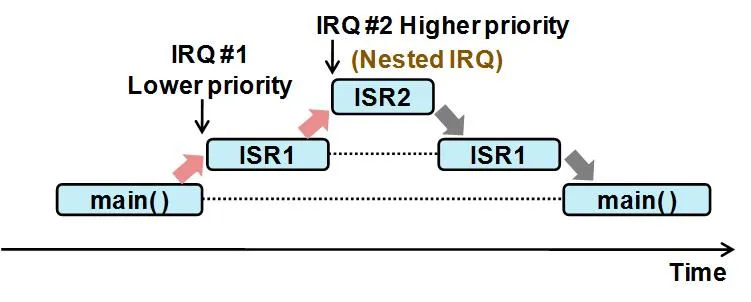
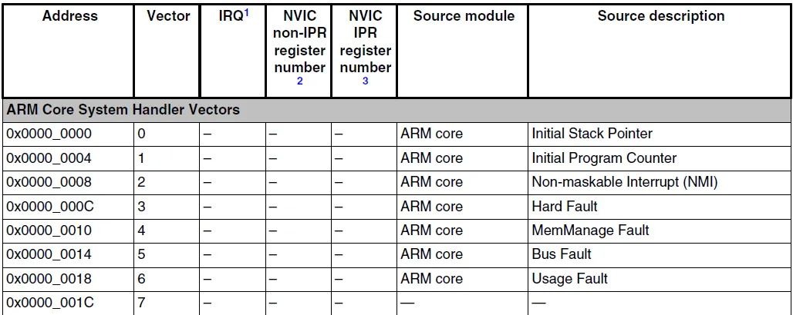

# Interruptores
## Introducción

Las interrupciones son eventos inesperados que interrumpen el flujo normal de un microcontrolador para atender tareas prioritarias, permitiendo una respuesta rápida a eventos internos o externos. Estas pueden generarse por hardware o software:

Tipos de instrucciones: 
* Hardware: 
    - enmascarables (IRQ o INT)
    - No enmascarables (NMI)
* Software: 
    - Normales (SWI)
    - Excepciones

Interrupciones por hardware: Provienen de eventos físicos, como cambios en entradas o salidas. Pueden ser **enmascarables** (controlables mediante un sistema de habilitación/deshabilitación y gestionadas por prioridades)se identifican comúnmente como IRQ o INT o **no enmascarables (NMI)**, que se atienden siempre sin importar las condiciones del programa.

Interrupciones por software: Son provocadas por instrucciones de software. Se dividen en interrupciones **normales (SWI)** que son activadas o provocadas por instrucciones de software, y **excepciones**, que surgen de errores como la división por cero.

 

## Modos de operación del procesador

En los microcontroladores ARM Cortex-M4, el procesador puede operar en dos modos principales: *Thread Mode y Handler Mode*.

* **Thread Mode:** Es el modo en el que el procesador ejecuta el código principal del programa. Durante este modo, el procesador puede ser interrumpido por eventos externos, como interrupciones de hardware, o ejecutar interrupciones pendientes de menor prioridad sin dejar de procesar el hilo principal del programa.

    Ejemplo: Si el procesador está ejecutando el bucle principal y se pulsa un botón, se interrumpe el proceso para manejar ese evento. Tras la interrupción, el procesador vuelve al modo Thread para continuar con el programa principal.

* **handler Mode:**Este modo se activa cuando el procesador responde a una interrupción o excepción. Mientras está en este modo, se deshabilitan otras interrupciones normales para que el manejo del evento actual no sea interrumpido. Es utilizado para eventos críticos como interrupciones de hardware o errores graves.

    Ejemplo: Cuando el temporizador SysTick genera una interrupción, el procesador cambia al modo Handler y ejecuta la función encargada de manejarla, como SysTick_Handler.

 

## Estado de Excepción
Los estados de excepción son claves en el funcionamiento de microcontroladores y procesadores, y describen cómo se gestionan las excepciones. Los principales estados son:

* **Inactivo:** No hay ninguna excepción presente. El sistema opera normalmente sin interrupciones.

* **Pendiente:** Una excepción ha sido detectada pero aún no ha sido atendida por el procesador.

* **Activo:** El procesador está manejando una excepción, ejecutando el código correspondiente.

* **Activo y Pendiente:** Ocurre cuando una excepción está siendo atendida, pero se han detectado otras del mismo tipo que aún no se han procesado.

Estos estados permiten un manejo estructurado de las excepciones, garantizando una respuesta eficaz ante eventos inesperados.

 

## Tratamiento de Interrupción
En un sistema embebido, pueden existir múltiples fuentes de interrupción, cada una con un nivel de prioridad. Algunos procesadores permiten anidar interrupciones, lo que significa que una interrupción de mayor prioridad puede interrumpir la ejecución de una rutina de servicio de interrupción (ISR) de menor prioridad. La ISR de baja prioridad se suspende y se reanuda una vez que la de alta prioridad ha terminado.

Esto se observa según la siguiente gráfica: 

donde al prncipio, se está ejecutando el main() de programa. Luego se recibe la primera interrupción, sin embargo, llega otra nueva interrupción de mayor prioridad, por lo tanto, se para la primera interrupción para tratar la de pioridad más alta. Una vez solucionada esta, se vuelve a la prioridad anterior para luego volver a seguir con el programa en normalidad en el main()

 

## Context Saving 
Cuando un microcontrolador atiende una interrupción, debe guardar y restaurar el contexto del programa para continuar su ejecución sin problemas. El contexto incluye registros del procesador, la pila y la dirección de retorno. Los pasos clave que sigue son:

1. Guardar el estado actual en la pila, incluyendo registros como el contador de programa (PC) y el registro de estado.

2. Cambiar al modo de manejador (Handler Mode) para ejecutar la rutina de interrupción.

3. Ejecutar la rutina de interrupción para manejar el evento que la causó.

4. Restaurar el estado previo del proceso desde la pila.
Volver al modo de usuario (User Mode) y reanudar el programa principal.

 

## Ejercicio: latencia
La latencia de las interrupciones es el tiempo que transcurre desde que ocurre una interrupción hasta que el procesador comienza a ejecutar la rutina de servicio de interrupción Este tiempo incluye varios factores, como:

1. Detección de la interrupción: El tiempo que tarda el sistema en identificar que se ha producido una interrupción.

2. Finalización de la instrucción actual: Si el procesador está ejecutando una instrucción, debe terminarla antes de responder a la interrupción.

3. Guardar el contexto: El procesador guarda el estado actual (registros, contador de programa, etc.) para poder retomar el proceso interrumpido más tarde.

4. Salto a la ISR: El procesador carga la dirección de la ISR y comienza a ejecutarla.

Una baja latencia de interrupción es crítica en sistemas embebidos de tiempo real, donde las interrupciones deben ser atendidas de manera rápida para asegurar el funcionamiento correcto del sistema.

 

## Módulo NVIC de ARM
El Nested Vectored Interrupt Controller (NVIC) es un módulo en los microcontroladores ARM Cortex-M4 que gestiona las interrupciones. Permite configurar la prioridad de cada interrupción, habilitar o deshabilitar interrupciones específicas y dirigir el flujo de ejecución al controlador adecuado a través de un vector de interrupción.

 

## Mapa de Interrupciones
El mapa de interrupciones es una lista en las primeras posiciones de la memoria que contiene punteros a las direcciones de los manejadores de interrupciones específicos. Los primeros vectores corresponden a interrupciones específicas de ARM, generadas por la CPU. Estos incluyen:

* **Initial Stack Pointer:** Indica el valor inicial del puntero de pila (SP), utilizado durante la inicialización del sistema.

* **Initial Program Counter:** Contiene la dirección de la primera instrucción a ejecutar, cargada en el Program Counter (PC).

* **Non-maskable Interrupt (NMI):** Interrupción crítica que no puede ser deshabilitada por el software.

* **Hard Fault:** Se activa ante fallos graves, como errores de acceso a memoria.

* **MemManage Fault:** Ocurre por violaciones de protección de memoria.

* **Bus Fault:** Indica errores de acceso al bus o dispositivos no válidos.

* **Usage Fault:** Se activa por uso incorrecto del procesador, como instrucciones inválidas.

Direcciones de memoria asignadas a los manejadores de interrupciones: 

 

## Interrupt Request (IRQ)
El número de IRQ (Interrupt Request) en el módulo NVIC (Nested Vectored Interrupt Controller) es un identificador único para cada tipo de interrupción en un microcontrolador. Este número permite al NVIC dirigir el flujo de ejecución hacia el controlador de interrupciones correspondiente al ocurrir una interrupción. 

## Registros para la Gestión de Interrupciones:
**ISER** (Interrupt SET ENABLE) y **ICER** (Interrupt CLEAR ENABLE): habilitar o deshabilitar interrupciones --> como el PSOR y PCOR

**ISPR** (Interrupt SET PENDING) e **ICPR** (Interrupt CLEAR PENDING):permiten establecer o borrar el estado pendiente de una interrupción --> tambien similares al PCOR y PSOR

 

## Niveles de Prioridad de Interrupciones
En los microcontroladores ARM Cortex-M4, las interrupciones se pueden clasificar en niveles de prioridad. Un valor más bajo de prioridad indica una mayor prioridad. Por ejemplo, una interrupción con prioridad 0 tiene la máxima prioridad, mientras que un 15 es una prioridad muy baja.

    // Configurar la prioridad del SysTick en el NVIC
    LDR R0, =0xE000ED20   // Dirección del registro de prioridad del NVIC para SysTick
    LDR R1, =0xF0000000   // Cargar la prioridad más baja (15 en binario)
    STR R1, [R0]          // Escribir la prioridad

    // Habilitar la interrupción en el NVIC
    LDR R0, =0xE000E100   // Dirección del registro NVIC ISER (Interruption Set Enable Register)
    LDR R1, =0x01000000   // Set bit para habilitar SysTick_IRQn (IRQ número 15)
    STR R1, [R0]          // Escribir en el registro NVIC ISER

 

## Determinar la configuración de una interrupción
1. Se localiza el número de la IRQ. 
2. Se calcula a que registro X corresponde ese bit

    $IRQ/32 -> 59/32=1$
3. Se calcula la posición del bit con la expresión:

    $IRQ~módulo~32~$ (operación del residuo)
4. Se calcula el registro de la prioridad: 

    $IRQ/4 -> 59/4=14$
5. Se calcula la posición de los bits (offset) de la prioridad: 

    $Offset = (IRQ ~mod~ 4) * 8 + 4 = 28$

 

## Funciones para configurar los registros
Para activar la interrupción:

    NVIC->ISER[(NUM_IRQ/32)]=(1<<(NUM_IRQ%32));
    //Otra opción más eficiente que reemplaza la anterior sería:
    VIC->ISER[(NUM_IRQ>>5)]=(1<<(NUM_IRQ & 0x1F));
    //Cuando se trabaja con el SDK se pueden utilizar las funciones
    NVIC_EnableIRQ(PORTA_IRQn);
​
Para desactivar la interrupción:

    NVIC->ICER[(NUM_IRQ/32)]=(1<<(NUM_IRQ%32)); //27 para este ejemplo específico
    //Otra opción más eficiente que reemplaza la anterior sería:
    NVIC->ICER[(NUM_IRQ>>5)]=(1<<(NUM_IRQ & 0x1F));
    NVIC_DisableIRQ(PORTA_IRQn);
​
Para forzar la interrupción: 

    NVIC->ISPR[(1)]=(1<<(NUM_IRQ/32));
    NVIC_SetPendingIRQ(PORTA_IRQn);
    Para evitar la interrupción
    NVIC->ISPR[(1)]=(1<<(27));  //27 para este ejemplo específico
    NVIC_ClearPendingIRQ(PORTA_IRQn);
​
Para la prioridad la interrupción (prioridad 3): 

    NVIC->IP[PORTA_IRQn]=(3<<4);
    NVIC_SetPriority(PORTA_IRQn,3);

 

## Ejemplos de rutinas de atención a la interrución

    __attribute__((interrupt)) void SysTick_Handler(void) {
        contador_systick++;
    }
    __attribute__((interrupt)) void LPIT0_Ch0_IRQHandler(void) {
        LPIT0->MSR |= LPIT_MSR_TIF0_MASK; //limpiar la badera
        contador_pit++;
    }
    __attribute__((interrupt)) void PORTC_IRQHandler(void) {
        if ((PORTC->ISFR & MASK_PULSADOR)!=0) {
            PORTC->ISFR = (MASK_PULSADOR);  //limpiar la badera
        }
        if ((PORTC->ISFR & MASK_PULSADOR2)!=0) {
            PORTC->ISFR = (MASK_PULSADOR2);  //limpiar la badera
        }
    }

 

## Eventos que producen la interrupción
Las interrupciones pueden ser generadas por diversos eventos, como cambios en los niveles de tensión en los pines de entrada/salida de un microcontrolador. Estos cambios se capturan como transiciones, denominadas flancos de subida (cambio de bajo a alto) o flancos de bajada (cambio de alto a bajo). Por ejemplo, al presionar un botón, se genera un flanco de subida, y al soltarlo, un flanco de bajada. Estos flancos pueden activar interrupciones y desencadenar rutinas de manejo específicas, lo que permite al microcontrolador responder eficientemente a eventos externos en tiempo real.