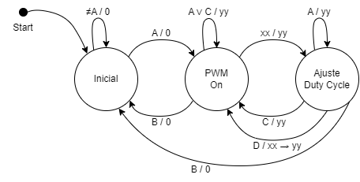

# Diagrama de Estados

Para la elaboración del proyecto, será necesario implementar una máquina de estados, que cumpla con los requisitos propuestos por el profesor. Según estos, nuestra máquina contará con 3 estados, y será una máquina de Mealy, pues cada salida dependerá tanto del estado actual como de las entradas que ocurran (opresión en el teclado de alguna tecla): 

1. Estado inicial: aquí se inicializará lo necesario para el correcto funcionamiento posterior de la máquina de estados. Este estado seguirá en ejecución hasta que se detecte la entrada A, que será efecto de la opresión de la tecla A en el teclado. 

2. En este estado, se activará el PWM y se podrá variar la intensidad del LED, a través de ingresar un número (de dos cifras) en el teclado, que es representado en el diagrama como la entrada xx. A partir de este estado, se tendrá en cuenta la interrupción del sistema cuando se oprima la tecla B, pasando instantáneamente al primer estado inicial. Una vez agregada cualquier entrada xx, se pasará al siguiente estado. 

3. Al presionar D, el valor de xx se guarda como yy, lo que establece el nuevo duty cycle. Luego, se vuelve al estado anterior, que es el de operación normal. Por otro lado, si se recibe la entrada C, se cancela cualquier cambio en el duty cycle, manteniendo el valor de yy, y también se regresa al estado previo. Al igual que en el estado anterior, si se presiona la tecla B, vuelve al estado inicial, donde aún no se había activado el PWM.