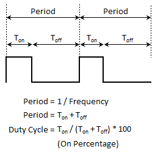

# Implementación del PWM

Parar la implemetación del PWM, se definieron las siguientes variables: 

```c
// Condiciones Iniciales PWM
dutycycle = 99; // De 0 a 99
dmax = 100U; // Periodo máximo con D = 100%
ton = (dmax * dutycycle) / 100;
toff = dmax - ton;
```
cumpliendo con la definición del PWM: 


De esta manera, mediante delays, se emuló el comportamiento del pwm, donde la señal de encendido, contaba con un delay de duración ton, y la señal apagada, una duración de Toff

```c
GPIO_PortClear(BOARD_LED_GPIO, 1u << BOARD_LED_GPIO_PIN);
SysTick_DelayTicks((dmax*dutycycle) / 100); // Tiempo encendido
GPIO_PortToggle(BOARD_LED_GPIO, 1u << BOARD_LED_GPIO_PIN);SysTick_DelayTicks(dmax-(dmax*dutycycle) / 100); // Tiempo apagado

```

con dutycycle = 99

con dutycycle = 10

como se puede observar, se nota la diferencia en la intensidad del led, debido a la frecuencia de encendido vs. apagado que se estableció, generando un promedio visible de luz más tenue a medida que el dutycycle se disminuía
